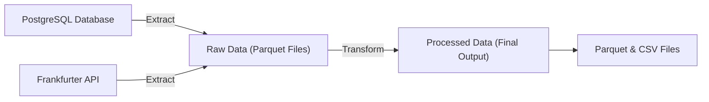

# 🎉 Welcome to Data Collection with Python 101 Project


This is a simple Data Engineering project that demonstrates how to build an ETL pipeline using native Python. The pipeline extracts data from a PostgreSQL database and the Frankfurter API, transforms and merges the data, and loads the final output into parquet and CSV files.

## Technologies Used ✨

This project is built with:

- `Python 3.9+`
- `Pandas`: Data processing and transformation
- `PostgreSQL` (e.g. NeonDB): Relational database for data storage
- `SQLAlchemy`: ORM for database interactions
- `Frankfurter API`: Currency conversion rates
- `Requests`: HTTP requests to external APIs

## Architecture 🏗️



## Key Features ⭐

- **Idempotent**: Safe to run multiple times without side effects
- **Date Partitioned**: Organized by run date for easy management
- **Raw/Processed Split**: Follows data lake pattern for better data management
- **Orchestration Ready**: Easy to migrate to tools like Airflow
- **Simple Error Handling**: Top-level exception handling only
- **Human Readable Output**: Clear console logs for monitoring

## Project Structure 📂

```
.
├── main.py                 # Main ETL pipeline script
├── requirements.txt        # Python dependencies
├── .env.example            # Example environment variables template
├── .env.dev                # Development environment variables
├── .env.prod               # Production environment variables
├── .gitignore              # Git ignore patterns
├── data/                   # Data directory (gitignored)
│   ├── raw/                # Raw data partitioned by date
│   │   ├── YYYY-MM-DD/
│   │   │    ├── products.parquet
│   │   │    ├── customers.parquet
│   │   │    ├── orders.parquet
│   │   │    ├── order_items.parquet
│   │   │    └── conversion_rate.parquet
│   │   └── sample/         # Sample data for testing
│   └── processed/          # Processed data partitioned by date
│       ├── YYYY-MM-DD/
│       │    ├── final_output.parquet
│       │    └── final_output.csv
│       └── sample/         # Sample data for testing
└── README.md               # This file
```

## Prerequisites 🛠️

To run this project, you will need `git`, `python` and `pip` installed on your machine. You will also need access to your own PostgreSQL database (e.g., NeonDB) with the required tables and data prepared from the [Brazilian E-Commerce Public Dataset by Olist](https://www.kaggle.com/datasets/olistbr/brazilian-ecommerce).

> See more details about how to preprocess and load the data into PostgreSQL in [my repository here](https://github.com/promsun/101-preprocess-dataset-with-kaggle-project-public).

## Getting Started 🚀

1. Clone down this repository. And navigate to the project directory.
2. Create a virtual environment (optional but recommended).

   ```bash
   python -m venv .venv
   source .venv/Scripts/activate   # On Git Bash (Windows)
   .venv\Scripts\activate   # On Command Prompt (Windows)
   ```

3. Install the necessary dependencies.

   ```bash
   pip install -r requirements.txt
   ```

4. Configure environment variables for development and production.

   ```bash
   # For development
   cp .env.example .env.dev

   # For production (Optional)
   cp .env.example .env.prod

   # Edit your DATABASE_URL in the env file
   ```

5. Run the main pipeline script.

   ```bash
   # Run with development environment (default)
   python main.py

   # Run with production environment
   ENV=prod python main.py
   ```

## Data Source 📊

1. 🔗 [Brazilian E-Commerce Public Dataset by Olist](https://www.kaggle.com/datasets/olistbr/brazilian-ecommerce)

   This dataset contains information of 100k orders from 2016 to 2018 made at Olist Store, an e-commerce platform that connects small and medium stores to consumers in Brazil. The dataset includes:

   - 🛒 Orders information
   - 📦 Order items and products
   - 👥 Customers demographics
   - 🏪 Sellers information
   - 💳 Payment details
   - ⭐ Product reviews
   - 📍 Geolocation data

2. 🔗 [Frankfurter API](https://frankfurter.dev/)

   This is a free API for current and historical foreign exchange rates published by the European Central Bank. In this project, we use it to get the BRL to THB conversion rates for the years 2016 to 2018.
